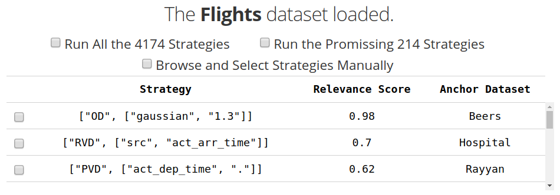
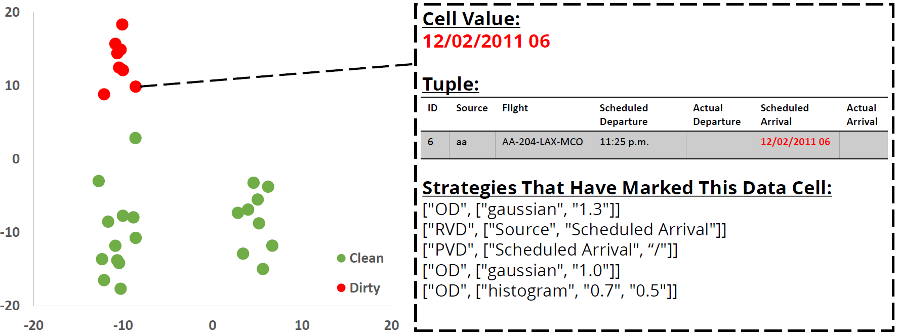
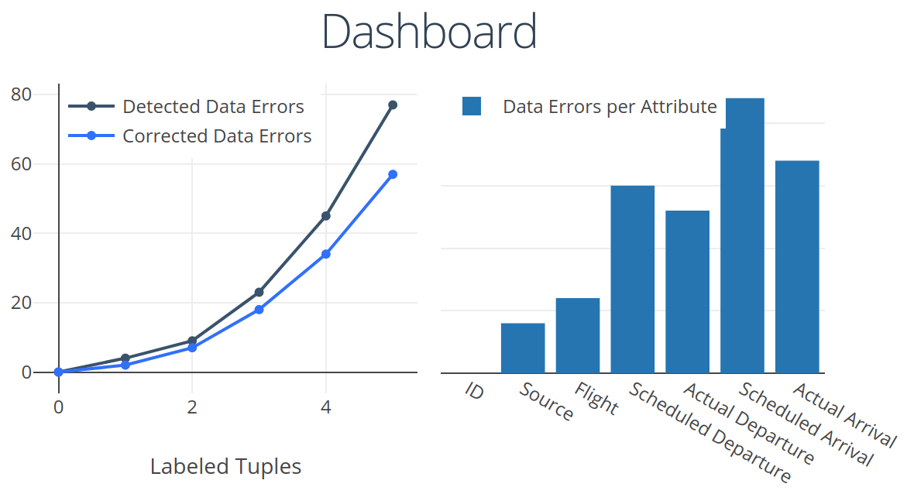

下面是针对Raha和Baran的中文版教程，帮助您了解如何使用这两个数据错误检测和修正系统。

# Raha 和 Baran 使用教程

Raha 和 Baran 是新的、无需配置的错误检测和修正系统。它们分别用于检测和修正数据中的错误。Raha 和 Baran 通过一个独特的两步方法进行错误检测和修正，以获得高精度和高召回率。

## 安装
您可以通过以下命令安装 Raha 和 Baran：
```bash
pip3 install raha
```

如果您需要卸载它们，可以使用以下命令：
```bash
pip3 uninstall raha
```

## 使用方法
使用 Raha 和 Baran 非常简单！以下是一些基本的使用方法：

### 1. **基准测试**
如果您有一个脏数据集以及对应的干净数据集，并希望对 Raha 和 Baran 进行基准测试，请查看 `raha/benchmark.py`、`raha/detection.py` 和 `raha/correction.py` 文件中的示例代码。这些代码将帮助您理解如何使用 Raha 和 Baran 进行数据清洗的基准测试。

### 2. **交互式数据清洗**
如果您有一个脏数据集并希望通过交互方式检测和修正数据错误，请查看 `raha` 文件夹中的 Jupyter Notebook。这些 Notebook 提供了图形用户界面，方便您在交互过程中标注和修正数据错误。

在这些界面中，您可以：
   - **数据标注**：通过标注工具帮助识别数据中的错误。
   - **策略选择**：查看不同策略以选择最适合的数据清洗方法。
   - **深入分析**：分析数据簇以发现和理解错误的来源。
   - **仪表板**：通过仪表板查看数据清洗的总体进展和效果。

以下是一些界面示例：
      
      
      
    

## 名称说明
Raha 和 Baran 是波斯语中的女性名字，与它们对应的错误检测和修正系统的特性密切相关。Raha（在波斯语中意为“自由”）表示我们的“无需配置”的错误检测系统。Baran（在波斯语中意为“雨”，雨水可以冲刷一切）表示我们的数据错误修正系统，用于“清洗”数据。

## 引用和参考文献
如果您希望引用此项目和对应的研究论文，可以使用以下的引用格式：

### 引用 Raha
```
@inproceedings{mahdavi2019raha,
  title={Raha: A configuration-free error detection system},
  author={Mahdavi, Mohammad and Abedjan, Ziawasch and Castro Fernandez, Raul and Madden, Samuel and Ouzzani, Mourad and Stonebraker, Michael and Tang, Nan},
  booktitle={Proceedings of the International Conference on Management of Data (SIGMOD)},
  pages={865--882},
  year={2019},
  organization={ACM}
}
```

### 引用 Baran
```
@article{mahdavi2020baran,
  title={Baran: Effective error correction via a unified context representation and transfer learning},
  author={Mahdavi, Mohammad and Abedjan, Ziawasch},
  journal={Proceedings of the VLDB Endowment (PVLDB)},
  volume={13},
  number={11},
  pages={1948--1961},
  year={2020},
  publisher={VLDB Endowment}
}
```

您可以在以下链接找到有关此项目和作者的更多信息：
- [Raha: A configuration-free error detection system](https://dl.acm.org/doi/abs/10.1145/3299869.3324956)
- [Baran: Effective error correction via a unified context representation and transfer learning](https://dl.acm.org/doi/abs/10.14778/3407790.3407801)

希望此教程能帮助您更好地理解和使用 Raha 和 Baran 进行数据清洗任务。如果您有其他问题或需要进一步的帮助，请随时告诉我。